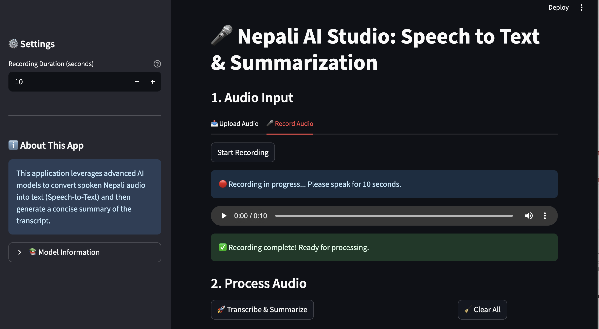
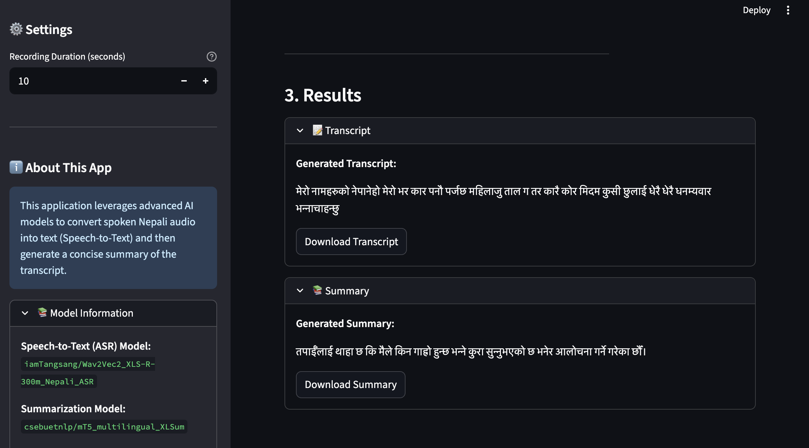

# Nepali AI Studio: Speech-to-Text & Summarization

🎤 **Nepali AI Studio** is an advanced AI-powered web application that converts Nepali speech into text and generates concise summaries of the transcribed content. Built with **Streamlit**, **PyTorch**, and **Hugging Face Transformers**, this project demonstrates an end-to-end pipeline for **Automatic Speech Recognition (ASR)** and **Text Summarization** in Nepali.

---

## Table of Contents

- [Demo](#demo)
- [Features](#features)
- [Installation](#installation)
- [Usage](#usage)
- [Screenshots](#screenshots)
- [Tech Stack](#tech-stack)
- [Future Enhancements](#future-enhancements)
- [Author](#author)
- [Contributing](#contributing)
- [License](#license)

---

## Demo

- Upload or record Nepali audio and instantly get the transcript.
- Generate a concise summary of long spoken content.
- Download both transcript and summary as text files.

---

## Features

- **Nepali Speech-to-Text** using `iamTangsang/Wav2Vec2_XLS-R-300m_Nepali_ASR`.
- **Text Summarization** using `csebuetnlp/mT5_multilingual_XLSum`.
- Real-time audio recording or file upload (WAV, MP3, M4A).
- Clear and user-friendly web interface with Streamlit.
- Downloadable transcript and summary.
- Session state handling for multiple audio inputs.

---

## Installation

1. **Clone the repository**

```bash
git clone <your-repo-url>
cd Nepali_speech_recognition_Summarizer
```

2. **Create and activate a virtual environment**

```bash
python3 -m venv venv
source venv/bin/activate  # macOS/Linux
venv\Scripts\activate     # Windows
```

3. **Install dependencies**

```bash
pip install -r requirements.txt
```

4. **Run the app**

```bash
streamlit run app.py
```

> Ensure you have a working microphone for recording, or upload audio files in WAV/MP3/M4A format.

---

## Usage

1. **Upload Audio**: Select a file from your local machine.
2. **Record Audio**: Click “Start Recording” and speak for the chosen duration.
3. **Transcribe & Summarize**: Click the button to get the transcript and summary.
4. **Download Results**: Use the provided download buttons for text files.

---


## Screenshots

- **Recording Phase**  
  

- **Results Display (Transcript & Summary)**  
  


---

## Tech Stack

- **Frontend**: [Streamlit](https://streamlit.io/)
- **Backend / AI Models**:
  - [Hugging Face Transformers](https://huggingface.co/)
  - `iamTangsang/Wav2Vec2_XLS-R-300m_Nepali_ASR` (Speech-to-Text)
  - `csebuetnlp/mT5_multilingual_XLSum` (Summarization)
- **Audio Processing**: `sounddevice`, `soundfile`, `librosa`
- **Deep Learning**: PyTorch

---

## Future Enhancements

- Add **real-time streaming transcription** without waiting for full recording.
- Integrate **multi-language support** beyond Nepali.
- Implement **voice activity detection** to auto-stop recording when speech ends.
- Add **speaker diarization** to identify multiple speakers.
- Deploy as a **cloud-hosted SaaS** with user authentication.
- Integrate **text-to-speech** to read out the summary.
- Add **summarization length control** with dynamic user input.
- **Improve ASR model performance** with more Nepali audio training data.
- **Next release**: include enhanced training and optimization for higher transcription accuracy.

---

## Author

**Arpan Neupane**\
Email: [arpanneupane75@gmail.com](mailto\:arpanneupane75@gmail.com)\
Phone: +977-9869540374

---

## Contributing

Contributions are welcome! Please follow these steps:

1. Fork the repository.
2. Create a feature branch (`git checkout -b feature-name`).
3. Commit your changes (`git commit -m "Description"`).
4. Push to the branch (`git push origin feature-name`).
5. Open a pull request.

---

## License

This project is licensed under the **MIT License**.

